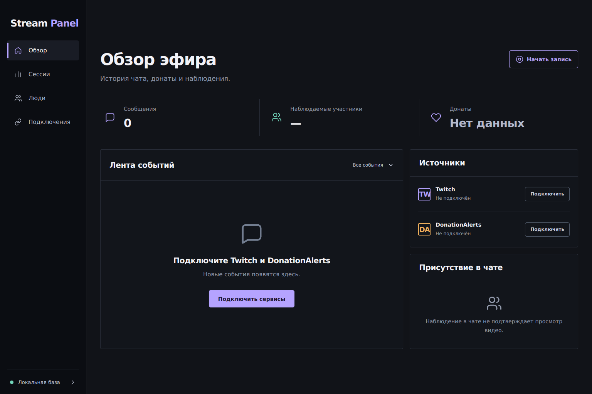

# Stream Panel

Локальная программа для аналитики Twitch + DonationAlerts: чат, донаты, сессии, люди и наблюдения по минутам. Данные хранятся на вашем компьютере в SQLite. Интерфейс открывается в браузере, сбор работает в отдельном процессе.

**Стадия: работающая ранняя версия в `codex-init`, созданной от `dev`.** Локальный цикл проверен тестами и браузером. Адаптеры Twitch/DA написаны, но вход в реальные аккаунты и получение живых событий ещё требуют проверки. Наблюдение участника в чате не означает просмотр видео. Полный набор целевой v1 отмечен отдельно в документации.



## Запуск

Нужны Node.js **24.19.0 или новее в ветке 24**, pnpm **11.25.0** и Git. Если pnpm ещё нет: `npm install -g pnpm@11.25.0`.

```sh
git clone --branch codex-init https://github.com/thesmithmode/Stream-Panel.git
cd Stream-Panel
pnpm install --frozen-lockfile
pnpm build
pnpm start
```

Откройте ссылку, напечатанную в терминале. Она одноразовая, действует 10 минут; после входа её ключ удаляется из адреса. Вкладку можно закрыть, процесс в терминале продолжит работать. Завершение — Ctrl+C. После перезапуска откройте новую напечатанную ссылку. Программа не заполняет базу выдуманными событиями.

В «Подключениях»:

- **Twitch:** зарегистрируйте своё public OAuth-приложение в [Developer Console](https://dev.twitch.tv/console/apps), введите Client ID и подтвердите Device Code вход владельцем канала. Client secret Twitch не нужен. Основные права: чтение чата и участников; подписки, Bits и фолловеры включаются отдельно.
- **DonationAlerts:** своё OAuth-приложение с Client ID / secret и redirect URI `http://localhost:47831/oauth/donationalerts/callback`, либо собственный уже полученный access token. Для обновления токена нужны refresh token и реквизиты приложения. Регистрацию localhost callback, возврат state и живой legacy WS handshake ещё необходимо проверить на аккаунте; при отказе REST и realtime имеют независимую диагностику.
- Время DA по умолчанию **неизвестно**: донаты сохраняются и входят в общую сумму, но не присваиваются минуте/сессии. UTC offset вводится только после проверки времени источника. Он применяется к новым фактам; старые автоматически не переписываются.

Секреты вводите в локальной панели. Их нет в API, git и snapshot базы. Пока они сохраняются в отдельном **незашифрованном** `secrets.json` (POSIX mode0600); интеграция с хранилищем ОС запланирована.

## Что работает

- Обзор: сообщения, отдельные суммы валют, последний полный опрос участников, лента и состояние источников.
- Сессии: ручная запись; в адаптере Twitch — обнаружение текущего эфира, стабильный stream ID и сверка каждые 60 секунд.
- Люди: отдельные Twitch ID и донатные события, кандидаты по имени, переименование, merge, undo и выборочный split с проверкой ревизий.
- Минутная сетка: «наблюдался / не наблюдался / нет данных», события выбранной минуты из базы.
- Согласованный локальный backup через SQLite API, с проверкой integrity / foreign keys / версии схемы.
- Дедупликация повторов WS/REST, точная арифметика денег, миграции и история aliases.

Ещё не реализованы: правила постоянной автопривязки донатных имён, отказ от кандидатов, фильтр ботов, расширенные топы/экспорт, облачный backup и автостарт/установщик. Streamer.bot и OBS-виджеты — последующие этапы.

## Данные и восстановление

По умолчанию: Linux — `$XDG_DATA_HOME/stream-panel` либо `~/.local/share/stream-panel`; Windows — `%LOCALAPPDATA%/StreamPanel`. Внутри: `data.sqlite`, `secrets.json`, `backups/`. Папку можно изменить через `STREAM_PANEL_DATA_DIR`; порт — `STREAM_PANEL_PORT` (default47831). При изменении порта измените зарегистрированный DA redirect URI; панель показывает актуальный URI.

Кнопка «Создать резервную копию» сохраняет проверенный snapshot в `backups/`. Для восстановления остановите программу, сохраните текущую папку отдельно, скопируйте snapshot в **новую** папку как `data.sqlite` и запустите с этой папкой через `STREAM_PANEL_DATA_DIR`. Вход в сервисы выполните заново. Не копируйте живую базу без WAL, не синхронизируйте её одновременно с двух компьютеров. Автоматического облачного sync сейчас нет.

## Разработчику

1. [Требования владельца](docs/user-requirements.md) и [PRD](docs/prd.md).
2. [Архитектура и инварианты](docs/tech-spec.md).
3. [Реальный контракт API](docs/api-contract.md).
4. [Проверенные источники и исправленные гипотезы](docs/research-notes.md).
5. [Выполненные проверки и ограничения](docs/validation.md).
6. [Следующие задачи и критерии готовности](docs/implementation-plan.md).

```sh
pnpm check
pnpm benchmark
```

`check` компилирует ядро, выполняет 27 тестов, проверяет Svelte и собирает production UI. Тесты используют временные данные и не обращаются к аккаунтам. [Benchmark](docs/benchmark-results.json) — синтетический storage smoke, не доказательство годовой нагрузки. CI настроен на Ubuntu и Windows; прохождение целевых Win11/Mint и живой записи отмечается отдельно.

Структура: `packages/core` — домен/SQLite; `apps/daemon` — worker, HTTP, OAuth и адаптеры; `apps/web` — Svelte UI; `scripts` — измерения. Exact dependencies и lockfile фиксированы. В `allowBuilds` разрешён только `better-sqlite3`.

[Stream Tools](https://b1trat3.ru/products/stream-tools) — ориентир локального рабочего процесса. Аналитическая модель спроектирована по требованиям владельца; её наличие в референсе публично не подтверждено.
