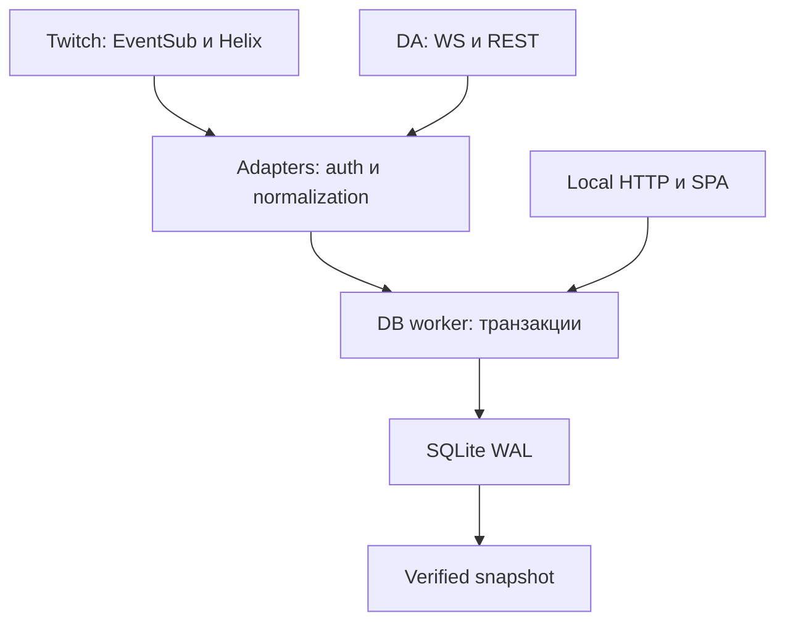

# Архитектура Stream Panel

Дата 2026-10-06. Различаем работающую раннюю версию и целевую v1. Таблица ниже — текущий код; backlog и release gates вынесены отдельно. PRD задаёт цель, но не является свидетельством готовности всех функций.

## Выбранный стек и границы

| Слой         | Реализация                                              | Почему / предел доказательства                                                                  |
| ------------ | ------------------------------------------------------- | ----------------------------------------------------------------------------------------------- |
| Runtime      | Node24.19+, TypeScript5.9.3, pnpm11.25                  | Один runtime Win/Linux; текущая установка Linux проверена                                       |
| Storage      | better-sqlite3 13.0.3, SQLite3.53.4 в текущей установке | Драйвер загрузился, actual WAL/backup/migrations прошли тесты; exact dependency + lockfile      |
| DB isolation | worker_threads, один StreamStore writer                 | Синхронный SQLite не блокирует WebSocket/main HTTP напрямую; очередь ограничена 10000pending RPC |
| HTTP         | Fastify5, cookie/static, loopback                       | Собственный локальный API и один origin для SPA, без внешнего analytics backend                 |
| UI           | Svelte5 + Vite8                                         | Production build и браузерный цикл проверены; обычный браузер, без Electron                     |
| Twitch       | fetch + ws, public Device Code, EventSub + Helix        | Протокол по официальным docs; live account gate открыт                                          |
| DA           | fetch + ws, lossless-json, legacy Centrifugo2 adapter   | Не предполагает современный centrifuge-js wire format; live handshake gate открыт               |
| Tests        | node:test, strict TypeScript, Svelte check              | 27 тестов; mock auth + реальные SQLite/HTTP/worker; browser QA отдельно                          |
| Backup       | SQLite online API → tmp → integrity/FK/version → rename | Локальная кнопка работает; scheduler/cloud ещё отсутствуют                                      |
| Distribution | Исходники + Node runtime + bundled static assets        | Запуск описан в README; installer/SEA/Tauri — отдельный будущий spike                           |

Native package install scripts разрешены только для better-sqlite3 через pnpm11 `allowBuilds`. Изменение драйвера/runtime допускается после конкретного неудачного измерения, не в виде вечного выбора «или то, или это».

## Компоненты

| Путь                                             | Ответственность                                                                              |
| ------------------------------------------------ | -------------------------------------------------------------------------------------------- |
| `packages/core/src/domain.ts`                    | EventInput, tuple dedupe key, exact money и candidate normalization                          |
| `packages/core/src/store.ts`                     | SQL, ingest, identity/person attribution, sessions, polls, queries, merge/undo/split, backup |
| `packages/core/src/schema.ts`                    | Транзакционные миграции 1/2 через user_version                                                |
| `packages/core/src/chatters.ts`, `presence.ts`   | Полная пагинация и чистая функция minute state                                               |
| `apps/daemon/src/db.ts`, `db-worker.ts`          | Ограниченный RPC, исключительное владение БД, whitelist операций                             |
| `apps/daemon/src/twitch.ts`, `donationalerts.ts` | Transport/OAuth, retry, права, normalization, source health                                  |
| `apps/daemon/src/config.ts`                      | Раздельные секреты, serialized temp-file writes, публичная redacted config                   |
| `apps/daemon/src/server.ts`, `index.ts`          | Host/Origin/nonce/CSRF, routes/static, data-dir lock, процесс                                |
| `apps/web/src`                                   | Статусы и действия через API; OAuth-секреты не запрашиваются обратно                         |

Сеть никогда не пишет SQL напрямую. Ingest подтверждается после транзакции. DB worker исполняет синхронные методы последовательно; async backup использует API драйвера. RPC переполнение/exit отвергают запрос, UI/adapter видят ошибку. **Нет** durable ingest queue, приоритетов/chunked reports и автоматического восстановления переполнения. На reconnect Twitch replay недоступен, DA догоняет доступную REST-историю.

## Домен и сохранность

**Identity:** `(source, account_id, external_id)`. Twitch external_id=user ID, имена — aliases. Scope v1 один канал; многоканальность требует отдельной миграции глобальных identities. DA external_id=donation occurrence ID: API не даёт stable donor ID. Каждый несопоставленный донат создаёт отдельную provisional группу. Anonymous actor не превращается в общий Person «Anonymous».

**Person:** управляемая группа identities. NFKC+trim+lowercase даёт кандидатов; без удаления@, транслитерации/сведения confusables. Совпадение имени не вызывает merge. Явные owner rules, отказ кандидата и preview применения к истории ещё не реализованы.

**Merge:** меняет только identity.person_id, не event.identity_id. Все исторические запросы join текущую membership; аудит содержит before/expected revisions. Undo требует неизменного состава/ревизий; новое сообщение той же identity не блокирует undo. Новый merge/split блокирует устаревшую отмену 409. Split выбирает identities одной группы, создаёт новый Person, сохраняет аудит и события. Переименование группы не меняет stable IDs.

**Dedupe:** JSON tuple `(source, account_id, type, external_id)`; transport не входит. Twitch chat key=event.message_id, остальные=metadata.message_id. DA WS/REST=recipient+alert ID. Streamer.bot позже должен сохранить platform source/IDs; если исходного ID нет, использовать его вместо direct transport для типа, а не параллельно.

**Fact:** UTC-ms или null, raw source_time, received_at_ms отдельно, time_quality provider/configured/unknown, transport и payload. Provider nanoseconds сохраняются в исходной строке, UI точность ms не выдаётся за точность действия. Twitch event timestamp предпочтительнее envelope publication при наличии; timeBasis отмечен в payload. Unknown time никогда не присваивается сессии по receivedAt.

**Money:** lossless JSON до Number, decimal→minor string, BigInt суммирование. Поддерживаются RUB,USD,EUR,BRL,TRY,PLN,UAH,KZT с 2decimal digits. Неизвестная валюта/precision отвергается и делает импорт ошибочным; отдельной durable quarantine пока нет. Валюты не складываются друг с другом, Bits не валюта DA. Amount не означает net payout.

**Moderation:** полученные delete/clear/clear_user_messages редактируют уже сохранённый текст. Не обещается полная поддержка delete-before-message/reordered transport: это отдельная задача hardening. Merge audit не удаляет факты; moderation intentionally редактирует содержание сообщений. Проверить условия хранения данных Twitch до распространения.

## Схема и запросы

Migration1: persons,identities,events,person_merges. Migration2: sessions,event_sessions,presence_polls,presence_members,identity_aliases,collection_gaps,membership_operations. STRICT таблицы, foreign_keys=ON, busy_timeout5s, WAL, synchronous=FULL. Новая версия схемы отвергается, не сбрасывается;0→1→2 и 1→2 транзакционны.

Деньги пока лежат в payload JSON и агрегируются BigInt в worker. Summary обходит выбранные факты; materialized rollups ещё нет. Events limit200,persons500,sessions100. Time range `[from,to)` и session filters поддержаны, cursor pagination нет. Индексы event time/identity, session links, poll time/members и candidates. Годовые отчёты/покрытие/per-source полнота должны получить отдельный нагрузочный тест перед добавлением rollups.

## Сессии и minute presence

Платформенная сессия `(Twitch account,stream ID)` устойчива при рестарте. Helix streams проверяется при старте и каждые 60s, онлайн/офлайн notifications вызывают reconciliation. Два последовательных пустых ответа закрывают запись с observed upper boundary; это не точное время конца эфира. Новый stream ID закрывает старую открытую сессию с estimated end. Ошибка Helix не равна offline.

Manual session создаётся только при отсутствии открытой записи; прекращается вручную. Существующая manual запись имеет приоритет при reconciliation. Platform запись закрывает адаптер, ручной stop API её отвергает. Требуется live проверка перехода manual↔platform и logout/relogin account boundaries.

Events известного времени связываются по полуоткрытому интервалу; известные DA timestamps относятся к единственному каналу v1 даже при отличающемся recipient ID. При обнаружении ранее начатого эфира уже записанные события перераспределяются. Unknown DA остаётся в общей истории и сумме, вне временной сессии.

Опрос Chatters: first1000, все страницы, дедуп user IDs; timeout30s,max100pages, cursor cycle→partial. Сохраняется started/completed/status и memberships. Основной minute grid использует только complete; даже положительная часть partial не становится полным доказательством основной сетки.

- `observed`: хотя бы один полный sample в UTC-минуте содержит identity Person.
- `not_observed`: полный sample есть, ни один не содержит.
- `unknown`: полного sample нет.

После merge — union identity membership, пересекающиеся минуты не суммируются. Интерполяции нет. Grid capped31days. При выборе минуты UI заново запрашивает events range из БД, а не фильтрует последние 200 общей ленты. Показывать coverage независимо от активности; ни chatters, ни сообщения не являются viewer telemetry.

## Twitch lifecycle

DCF: собственный public Client ID; базовые user:read:chat/moderator:read:chatters, optional followers/subscriptions/bits. Poll interval провайдера, не чаще 5s; authorization_pending и slow_down. Refresh single-flight, one-time rotated refresh сохраняется в serialized config. Validate startup/hourly проверяет client/user/scopes.401 один refresh/retry,429 блокировка до reset.5xx показывается как ошибка; общий адаптер делает reconnect, универсального per-request retry пока нет.

WS listener устанавливается до HTTP subscriptions. Welcome → chat,moderation,stream online/offline,raid и доступные optional subscriptions. Keepalive deadline включает grace5s. `session_reconnect` принимает только wss eventsub.wss.twitch.tv: новое welcome → handoff; подписки унаследованы, без повторной регистрации. Unexpected close → capped exponential backoff+jitter → новый welcome/subscribe, gap без replay. Lifecycle generations блокируют сообщения остановленного подключения; все handoff sockets закрываются при stop.

Отозванная подписка имеет собственный статус. Потеря соединения видна в source state. Время chatters cache неизвестно: poll60s не гарантирует свежесть 60s. Системный sleep, catch-up и revocation требуют живого soak-теста.

## DonationAlerts lifecycle

BYO own Client ID/secret; Authorization Code scopes user-show/donation-subscribe/donation-index. State TTL10min, одноразовый; missing/mismatch отклоняется до token exchange. Localhost redirect/state echo — открытый gate. Альтернативный собственный token import есть в UI; без refresh/app реквизитов expiry требует повторного входа.

`user/oauth` → socket_connection_token+recipient → legacy WS connect `{params:{token},id:1}` → client UUID → HTTP centrifuge/subscribe → WS subscribe method1. ACK подтверждает realtime отдельно от REST. Handshake20s, maxWS payload1MiB, reconnect30s. **Нет подтверждённого client heartbeat/token-expiry сценария:** возможные protocol отличия не скрываются статусом REST.

REST запускается параллельно с WS и далее каждые 5min: страницы 1..1000, общий pacing1100ms, timeout15s,401refresh,429Retry-After. До конца доступных pages history=`Импорт…`; ошибка/лимит означает неполноту. Ordering/snapshot pagination не документированы: весь scan повторяется с page1, на known ID не останавливаемся. Cursor checkpoint между процессами нет; restart безопасен благодаря DB dedupe, но может повторить долгую загрузку.

DA created_at без зоны остаётся null. Можно ввести **проверенный fixed UTC offset minutes**±840; это не IANA/DST resolver, относится только к новым фактам. Историческая перепроекция с preview/таймзонами ещё не реализована. Неизвестные события не теряются из суммы.

## Local security, процесс и backup

Bind127.0.0.1, exact Host+Origin, no CORS, CSP и no-store, body32KiB. Nonce fragment10min/one-use → cookie HttpOnly/SameSiteStrict24h; POST JSON+CSRF. Значения событий Svelte escapes, не raw HTML. Секреты не возвращаются и не логируются. Сессии auth in-memory, после рестарта новая ссылка.

Config version1 отдельно от data.sqlite, temp write+atomic rename; POSIX0600, directory0700. **Файл не зашифрован**, Windows ACL/credential store ещё gate. Он не входит в snapshot. Это не защита от другого процесса того же пользователя.

Exclusive PID lock data-dir, active second writer rejected даже на другом порту; stale PID recovery. Ctrl+C/SIGTERM закрывают sockets, adapters, DB и lock. Bounded10s shutdown/sleep gaps/автостарт ещё backlog; не заявлять эти цели реализованными.

Snapshot: online backup while WAL writer открыт, readonly destination integrity_check/foreign_key_check/version2, tmp→atomic rename. Локальная кнопка, без scheduler/rotation/remote. Restore в новый data-dir с остановленным writer описан в README, проверяется при запуске схемой; отдельный CLI/UI preview восстановления ещё нужен.

Будущий cloud backup: single writer, отдельный object prefix на установку, не двусторонний sync. Litestream0.5 Windows support есть, age encryption нет. R2 free tier ограничен storage/operations; sync interval60s — только предполагаемый budget, проверяется restore+usage экспериментом. Не коммитить непроверенный cloud config как рабочую функцию.
